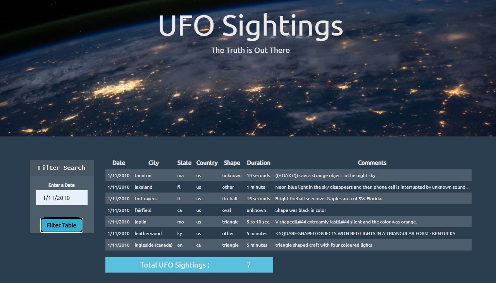
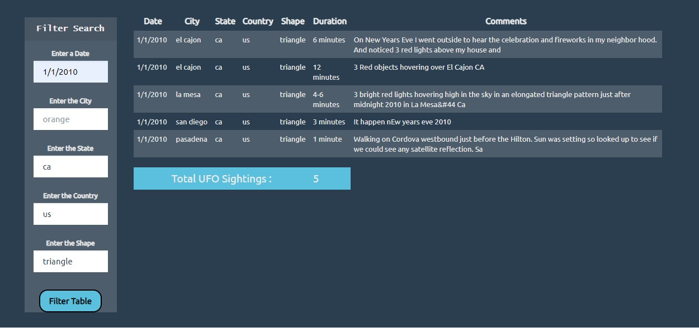

# JavaScript-challenge


## Project : JavaScript and DOM Manipulation with D3.js

## Table of contents
* [Introduction  ](#introduction )
* [Objective](#objective)
* [Features to Look For](#objective)
* [Screen Shots](#screen-shots)
* [Technologies](#technologies)
* [Code](#code)
* [Status](#status)
* [Acknowledgement ](#acknowledgement )
* [Contact](#contact)



## Introduction  
### Project Description: Dynamic table creation for the UFO data provided, based on the user input using JavaScript, HTML, and CSS, Bootstrap and D3.js 

## Objective

### Level 1 : 
* Build a custom HTML webpage [UFO-level-1/index.html](/UFO-level-1/index.html) with div containers for user search field and dynamic table creation(use bootstrap classes).
* Using the UFO dataset provided in the form of an array of JavaScript objects, write code that appends a table to your web page and then adds new rows of data for each UFO sighting.
* Write JavaScript code using D3.js that will listen for events and search through the date/time column to find rows that match user input.

### Level 2 : 
* Using level 1 script,  write JavaScript code [UFO-level-2/index.html](/UFO-level-2/index.html) so that the user can set multiple filters and search for UFO sightings using the following criteria based on the table columns:

	* date/time
	* city
	* state
	* country
	* shape

## Data Source
	
- [UFO data -List of JavaScript objects](/UFO-level-1/static/js/data.js )



### Features To Look For 
* Data can be filtered by any given field. 
* Script can handle individual as well as multiple filters from any field.
* Other features 
	* Bootstrap classes to prettify the HTML 
	* D3.js DOM manipulator functions and event handlers
	* JavaScript functions
	



## Screen Shots





## Technologies and Tools
* Visual Studio Code Editor
* GitBash, GitHub
* chrome DOM
* HTML , CSS, Bootstrap
* JavaScript
* D3.js
	
	

## Code 
- [UFO Level 1-javascript-D3.js script](/UFO-level-1/index.html)
- [UFO Level 2-javascript-D3.js script](/UFO-level-2/index.html)


## Setup
1. Git clone this repository
2. Open [UFO Level 1-javascript-D3.js script](/UFO-level-1/index.html) and  [UFO Level 2-javascript-D3.js script](/UFO-level-2/index.html) in chrome browser.
3. Filter through the data to dynamically update the table based on the selected input.


## Status
Project Complete

## Acknowledgement 
- Data for this project came from UTSA BootCamp


## Contact
[Divya Shetty](https://github.com/divya-gh)

 























